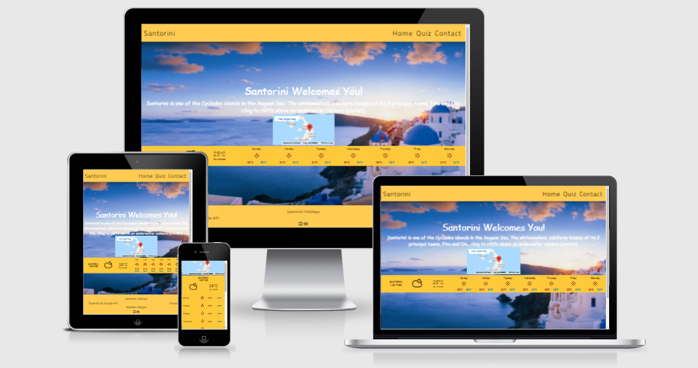

# Holidays

[Live Site](https://j0hn1975.github.io/MS2-Santorini/)

### Table of Contents
> - [Overview](#overview)
> - [UX](#ux)
> - [User Stories](#user-stories)
> - [Wireframes](#Add-links-to-wireframes)
> - [Features](#features)
> - [Technolgies Used](#technolgies-used)
> - [Testing](#testing)
> - [Credits](#credits)

### Overview
> A website bassed on the real life Greek Island of Santorini. This site is designed to showcase the natural beauty of the isalnd and it's beautiful sunsets.

### Technolgies Used
> HTML
>
> CSS
>
> Javascript

### Testing

HTML Validation

I have used the W£C Markup Validation Service to check my HTML is valid

HTML validation passed with 0 errors
[HTML Validation](assets/docs/HTML-Validation/HTML_Validation.PNG)

